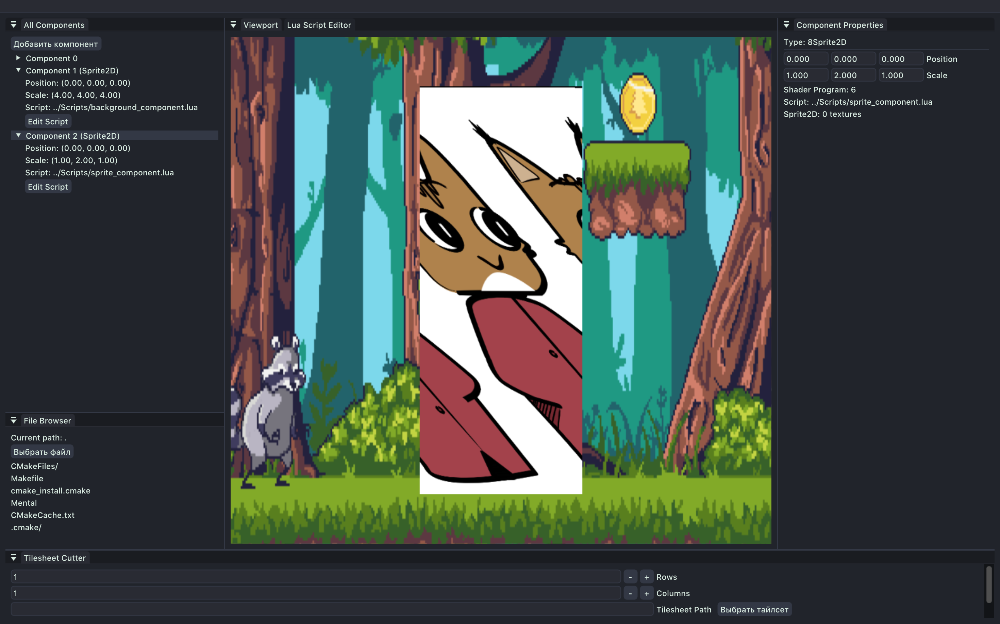

# Mental
2D/3D Game Engine written from scratch with OpenGL renderer.



# Dependencies:
- cmake
- make
- glfw
- glew


# Build
```sh
mkdir Build && cd Build && cmake .. && make
```

# Tested on:
- Macbook Air M2 Sequoia 15.5 with brew installed dependencies.